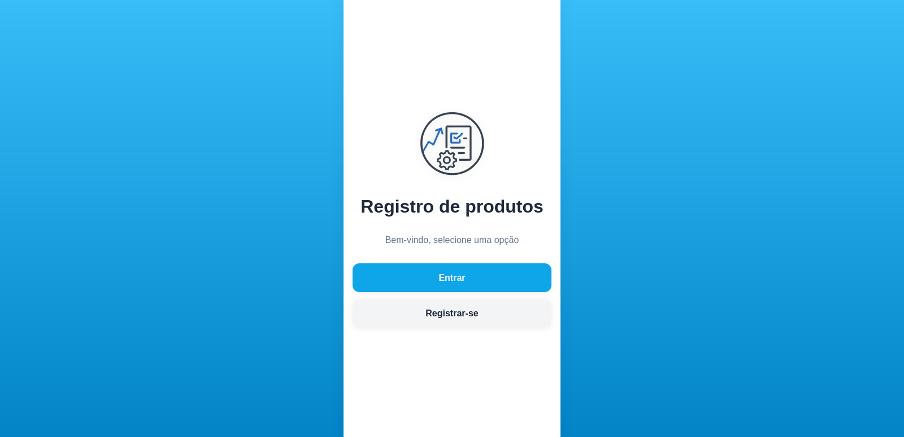
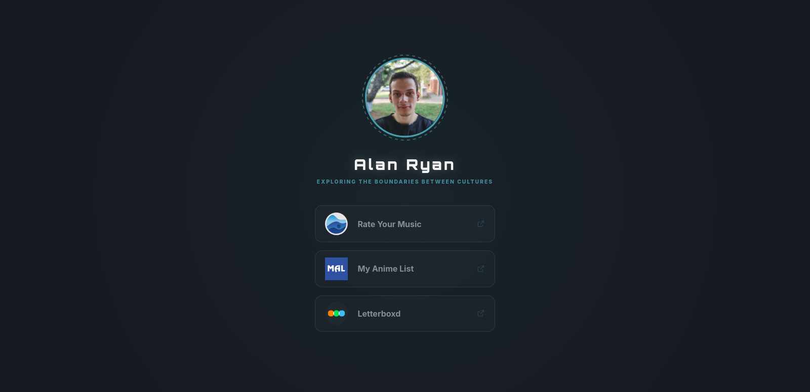
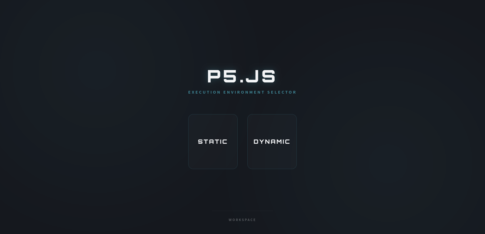

# Projetos

[← Voltar ao README](../../README.md)

Documentação detalhada de cada projeto do **Astro Workspace**.

## Índice

- [🎭 ATARASHII GAKKO! Landing Page](#atarashii-gakko)
- [🛒 Product Management](#product-management)
- [📝 Scriptora](#scriptora)
- [👤 Profile](#profile)
- [🎨 p5.js Workspace](#p5js-workspace)

---

## 🎭 ATARASHII GAKKO! Landing Page <a name="atarashii-gakko"></a>

**📁 Pasta:** `projects/atarashii-gakko/`  
**🎯 Descrição:** Clone da landing page oficial do grupo japonês ATARASHII GAKKO!, apresentando sua discografia mais recente, datas da turnê mundial e cadastro de newsletter.


### ✨ Funcionalidades

- **🎵 Seção de Discografia:** Exibição visual dos álbuns e singles mais recentes
- **🌍 Datas da Turnê Mundial:** Lista interativa de shows com informações de venues
- **📧 Newsletter:** Sistema de cadastro para receber atualizações
- **📱 Design Responsivo:** Otimizado para dispositivos móveis e desktop
- **🎨 Interface Moderna:** Uso de SCSS para estilização avançada

### 🛠️ Tecnologias Utilizadas

- **Framework:** Astro 5.14.1
- **Estilização:** SCSS/Sass
- **Ícones:** FontAwesome
- **Deploy:** Vercel (configurado)
- **Tipagem:** TypeScript

### 📂 Estrutura do Projeto

```
src/
├── components/
│   ├── discography/
│   ├── hero/
│   ├── newsletter/
│   ├── tour/
│   └── social-nav/
├── layouts/
├── pages/
├── scripts/
└── styles/
```

### 🎨 Recursos de Design

- **Tipografia Customizada:** Fontes Bebas Neue, Courier e Roboto Mono
- **Paleta de Cores:** Baseada na identidade visual do grupo
- **Componentes Modulares:** Arquitetura componentizada para fácil manutenção
- **Animações Sutis:** Interações visuais aprimoradas

---

## 🛒 Product Management <a name="product-management"></a>

**📁 Pasta:** `projects/product-management/`  
**🎯 Descrição:** Sistema completo para cadastro, edição e listagem de produtos, com autenticação de usuários e integração ao Firebase. O projeto utiliza Astro com React, SCSS modular, tipagem TypeScript e layout centralizado, focando em boas práticas de UX e arquitetura escalável.



### ✨ Funcionalidades

- **🔐 Autenticação:** Login e registro de usuários com Firebase Auth
- **📦 Cadastro de Produtos:** Adição, edição e remoção de produtos
- **📋 Listagem Dinâmica:** Visualização dos produtos cadastrados
- **🎨 SCSS Modular:** Estilos organizados por componente e variáveis globais
- **⚛️ Componentes React:** Formulários e listas interativos com tipagem forte
- **🗄️ Integração com Firebase:** Persistência dos dados dos produtos e usuários
- **🖌️ Identidade Visual:** Logotipo próprio e fontes customizadas

### 🛠️ Tecnologias Utilizadas

- **Framework:** Astro 5.14.1
- **UI Library:** React 19.1.1
- **Estilização:** SCSS/Sass modular
- **Autenticação & Banco:** Firebase
- **Tipagem:** TypeScript
- **Deploy:** Vercel (configurado)

### 📂 Estrutura do Projeto

```
src/
├── assets/
├── components/
├── layouts/
├── lib/
├── pages/
└── styles/
    └── components/
```

### 🧩 Recursos Demonstrados

- **Autenticação com Firebase:** Fluxo completo de login e registro
- **CRUD de Produtos:** Adicionar, editar, remover e listar produtos
- **Layout Centralizado:** Template global para todas as páginas
- **SCSS com Variáveis:** Design tokens centralizados para cores, fontes e espaçamentos
- **Componentização:** Separação clara entre lógica, apresentação e dados
- **Deploy Vercel:** Pronto para publicação com adapter configurado

### 🎨 Características Técnicas

- **TypeScript First:** Tipagem forte em todo o projeto
- **SCSS Modular:** Estilos organizados por componente
- **Arquitetura Limpa:** Separação entre dados, lógica e apresentação
- **Identidade Visual:** Logotipo próprio e fontes customizadas

---

## 📝 Scriptora <a name="scriptora"></a>

**📁 Pasta:** `projects/scriptora/`  
**🎯 Descrição:** Blog e site de conteúdo construído com Astro, focado em publicação de artigos usando as Content Collections do Astro. O projeto reúne um conjunto de componentes reutilizáveis (cards, navbar, busca, paginação), uma API simples de busca (serverless) e uma organização de conteúdo em Markdown para facilitar criação e manutenção editorial.


### ✨ Funcionalidades

- **📰 Gestão de Conteúdo:** Conteúdos em Markdown organizados em `src/content/blog/` com metadados (tags, data, autor)
- **🔎 Busca Local:** Endpoint de busca (`src/pages/api/search.json.ts`) para pesquisar artigos
- **🏷️ Tags & Páginas de Tag:** Filtragem por tags e listagem de artigos por tag
- **📄 Páginas de Artigo Dinâmicas:** Roteamento para artigos em `src/pages/articles/[...slug].astro`
- **🧩 Componentes Reutilizáveis:** `ArticleCard`, `SearchForm`, `Pagination`, `Navbar`, `Tags`
- **📸 Gestão de Imagens:** Pastas de imagens públicas e otimização via integração com o pipeline de build do Astro
- **📱 Responsividade:** Layouts e componentes otimizados para mobile e desktop

### 🛠️ Tecnologias Utilizadas

- **Framework:** Astro
- **Estilização:** Tailwind CSS
- **Tipagem:** TypeScript
- **Deploy:** Vercel
- **Conteúdo:** Astro Content Collections (Markdown)

### 📂 Estrutura do Projeto

```
src/
├── components/
├── content/
│   └── blog/
├── layouts/
├── pages/
│   └── articles/
└── assets/
```

### 🔬 Recursos Demonstrados

- **Uso de Content Collections:** Organização editorial via `src/content` com frontmatter e metadados
- **Geração Estática com buscas server-side:** Combina SSG com um endpoint de busca para melhor UX
- **Componentização do front-end:** Cards, listas e formulários reutilizáveis que facilitam escalabilidade
- **Integração com Vercel:** Output otimizado para deploy e funções servidoras (serverless)

### 🎨 Características Técnicas

- **SSG & ISR:** Conteúdo estático com possibilidade de atualização incremental dependendo do fluxo de publicação
- **Arquitetura orientada a conteúdo:** Separação clara entre conteúdo (Markdown) e apresentação (Astro components)
- **Performance-first:** Tailwind + Astro para pages leves e rápido Time-to-First-Byte
- **Experiência editorial:** Fluxo simples para adicionar novos posts via Markdown

---

## 👤 Profile <a name="profile"></a>

**📁 Pasta:** `projects/profile/`  
**🎯 Descrição:** Página de perfil pessoal construída com Astro, focada em centralizar links externos em uma experiência visual marcante. O projeto possui duas variações de interface (`/v1` e `/v2`) e redireciona a rota principal para a versão padrão.




### ✨ Funcionalidades

- **🔁 Redirecionamento Inteligente:** A rota `/` redireciona automaticamente para `/v1`
- **🧩 Duas Versões de Interface:** `v1` com cards centralizados e `v2` com layout split interativo
- **🖼️ Avatar e Isotipos:** Exibição de foto de perfil e logos de plataformas sociais
- **🔗 Link Hub Pessoal:** Atalhos para Rate Your Music, MyAnimeList e Letterboxd
- **🎨 Identidade Visual Própria:** Tema dark com animações, transições e tipografia customizada
- **📱 Responsividade:** Adaptação de layout para desktop e mobile

### 🛠️ Tecnologias Utilizadas

- **Framework:** Astro 5
- **Estilização:** SCSS/Sass
- **Ícones:** Font Awesome
- **Tipagem:** TypeScript (config strict do Astro)
- **Deploy:** Vercel (adapter configurado)

### 📂 Estrutura do Projeto

```
src/
├── components/
│   ├── v1/
│   └── v2/
├── data/
├── layouts/
├── pages/
└── styles/
```

### 🔬 Recursos Demonstrados

- **Arquitetura orientada a dados:** Informações do perfil centralizadas em `src/data/profile.ts`
- **Componentização por versão:** Separação clara dos componentes de `v1` e `v2`
- **Layout global reutilizável:** Base compartilhada com controle de scroll por página
- **Design tokens com SCSS:** Variáveis globais para cores e consistência visual
- **Deploy-ready:** Projeto pronto para publicação na Vercel

### 🎨 Características Técnicas

- **Projeto enxuto e focado:** Estrutura simples para manutenção e expansão
- **Roteamento por arquivos:** Páginas em `src/pages` com comportamento previsível
- **UI com microinterações:** Hover effects, animações e transições suaves
- **Separação de responsabilidades:** Dados, layout e componentes organizados por domínio

---

## 🎨 p5.js Workspace <a name="p5js-workspace"></a>

**📁 Pasta:** `projects/p5js-workspace/`  
**🎯 Descrição:** Landing page desenvolvida com Astro para selecionar rapidamente ambientes de execução de sketches p5.js, com foco em navegação direta para variações estática e dinâmica.



### ✨ Funcionalidades

- **🧭 Seletor de Ambientes:** Atalhos rápidos para execuções `STATIC` e `DYNAMIC`
- **🧱 Arquitetura Enxuta:** Estrutura simples com separação entre layout, componente principal e dados
- **🧾 Dados Tipados:** Links centralizados em camada TypeScript (`src/data/links.ts`)
- **🎨 Tema Customizado:** Identidade visual com variáveis SCSS, tipografia externa e efeitos de destaque
- **📱 Interface Responsiva:** Comportamento adaptado para diferentes tamanhos de tela

### 🛠️ Tecnologias Utilizadas

- **Framework:** Astro 5
- **Estilização:** SCSS/Sass
- **Tipagem:** TypeScript
- **Deploy:** Vercel (configurado)

### 📂 Estrutura do Projeto

```
src/
├── assets/
├── components/
├── data/
├── layouts/
├── pages/
└── styles/
```

### 🔬 Recursos Demonstrados

- **Composição orientada a componentes:** Tela principal desacoplada do layout base
- **Design tokens globais:** Variáveis SCSS para cores e consistência visual
- **Navegação por dados:** Rotas externas gerenciadas por estrutura tipada
- **Landing page focada em tarefa:** Fluxo rapido para abrir ambientes de sketch

### 🎨 Características Técnicas

- **Frontend estático de alta performance:** Build otimizado via Astro
- **Estrutura manutenível:** Divisão clara entre apresentação e configuração de links
- **Escalável para novos destinos:** Fácil adição de novos ambientes de execução
