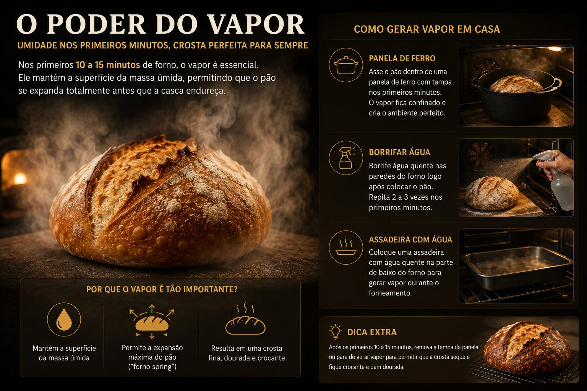

Fazer pão em casa é um processo terapêutico, mas muitos padeiros iniciantes sofrem para conseguir aquela crosta dourada e crocante típica das padarias europeias. O segredo não está apenas na massa, mas no controle da umidade e da temperatura durante os primeiros minutos de forneamento.

## O Poder do Vapor

Nos primeiros 10 a 15 minutos de forno, o vapor é um dos fatores mais importantes para o desenvolvimento de um pão artesanal de qualidade. Durante essa etapa inicial do forneamento, a superfície da massa precisa permanecer úmida para permitir que o pão cresça livremente antes que a crosta endureça. Esse fenômeno é conhecido entre padeiros como _oven spring_, o momento em que o calor faz a fermentação acelerar rapidamente e os gases internos expandirem a estrutura da massa.

Quando não há vapor suficiente, a casca endurece cedo demais, impedindo a expansão adequada do pão. O resultado costuma ser um pão mais denso, com cortes pouco abertos e uma crosta seca sem brilho. Já a presença correta de umidade ajuda a formar aquela crosta fina, crocante e caramelizada típica de padarias artesanais europeias.

Mesmo sem um forno profissional, é possível reproduzir esse efeito em casa. Uma das técnicas mais populares é assar o pão em uma panela de ferro com tampa, que aprisiona o vapor liberado pela própria massa durante os primeiros minutos. Outra alternativa é borrifar água quente nas paredes do forno ou colocar uma assadeira com água fervente na parte inferior para gerar vapor constante durante o início do cozimento.

## Reação de Maillard

O escurecimento da crosta acontece graças à Reação de Maillard, um processo químico complexo que ocorre quando aminoácidos e açúcares redutores são expostos a altas temperaturas. Essa reação é responsável não apenas pela coloração dourada e intensa do pão, mas também pelos aromas tostados, amanteigados e levemente adocicados que surgem durante o forneamento.

À medida que o pão assa, centenas de compostos aromáticos são formados na superfície da massa. É esse conjunto de transformações químicas que cria a diferença entre um pão comum e um pão artesanal com sabor profundo e aparência marcante. Quanto mais equilibradas forem a fermentação, a hidratação e a temperatura do forno, mais rica será a complexidade de aromas e sabores produzidos pela Maillard.

Uma fermentação longa a frio, feita na geladeira por várias horas ou até durante a noite, ajuda significativamente nesse processo. Durante esse tempo, enzimas quebram os amidos da farinha em açúcares mais simples, fornecendo mais “combustível” para a reação química acontecer no forno. O resultado costuma ser uma crosta mais escura, brilhante e caramelizada, além de um sabor mais intenso e levemente adocicado.

Outro fator importante é a temperatura inicial do forno. Fornos muito frios dificultam a caramelização correta da superfície, enquanto temperaturas altas nos primeiros minutos favorecem a formação rápida da crosta dourada e aromática tão desejada no pão artesanal.

## O Resfriamento Final

Depois de sair do forno, o pão ainda passa por uma etapa extremamente importante do processo: o resfriamento. Embora muita gente tenha vontade de cortar o pão imediatamente por causa do aroma intenso e da crosta recém-assada, o interior da massa continua se estabilizando durante vários minutos após o forneamento. Nesse momento, o calor residual ainda redistribui a umidade dentro do pão, finalizando lentamente a estrutura do miolo.

Por isso, o ideal é colocar o pão sobre uma grade logo após retirá-lo do forno. Esse detalhe simples permite que o ar circule por todos os lados, evitando que o vapor fique preso na parte inferior e amoleça a crosta. Quando o pão é deixado sobre uma superfície fechada, como uma forma ou bancada lisa, a condensação pode surgir rapidamente, comprometendo aquela textura seca e crocante tão valorizada na panificação artesanal.

Outro ponto importante é que a crosta continua “assentando” durante o resfriamento. Os estalos e pequenos sons que muitos pães fazem ao sair do forno acontecem justamente porque a estrutura externa ainda está perdendo umidade e se contraindo lentamente. Esse processo ajuda a preservar a crocância e intensifica ainda mais os aromas desenvolvidos durante a Reação de Maillard.

Cortar o pão cedo demais pode afetar diretamente a textura interna. O miolo ainda estará muito úmido e elástico, podendo parecer pesado ou até ligeiramente cru, mesmo quando o pão já está completamente assado. Esperar pelo menos 30 a 60 minutos antes de cortar permite que a umidade interna se estabilize corretamente, resultando em fatias mais leves, aeradas e com estrutura melhor definida.

Além de melhorar a textura, o resfriamento adequado também influencia no sabor final. À medida que o pão esfria, os aromas se tornam mais equilibrados e a percepção dos sabores fermentados, tostados e caramelizados fica ainda mais evidente, tornando a experiência muito mais rica.

