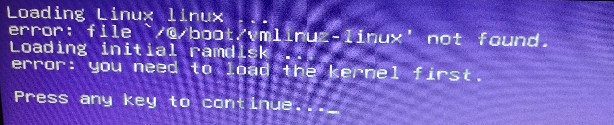
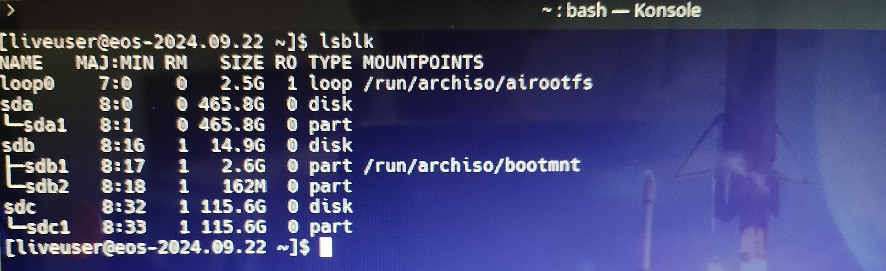
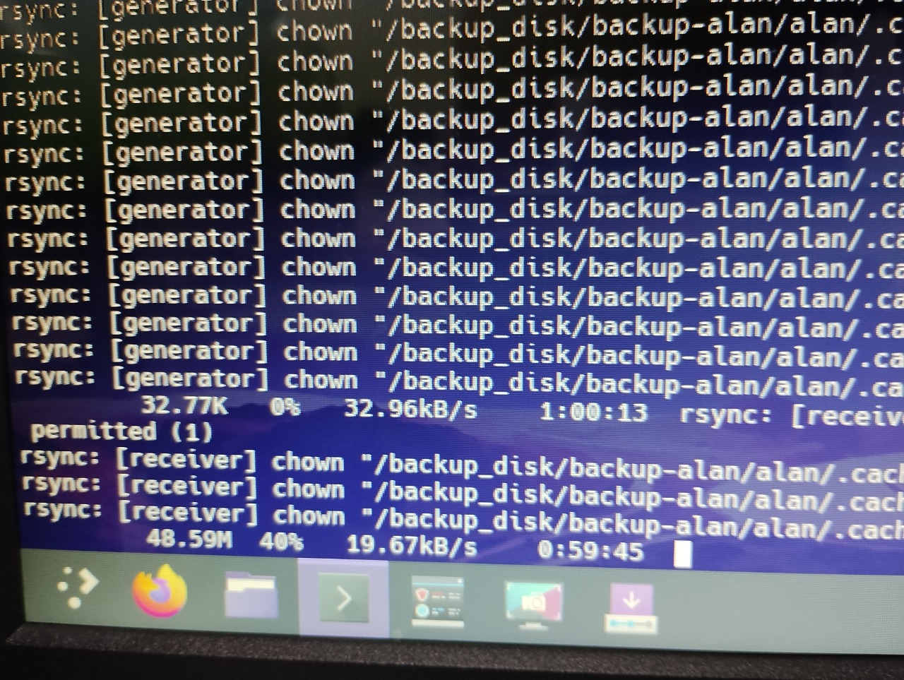
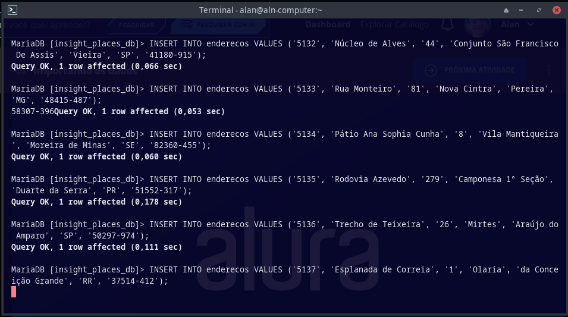
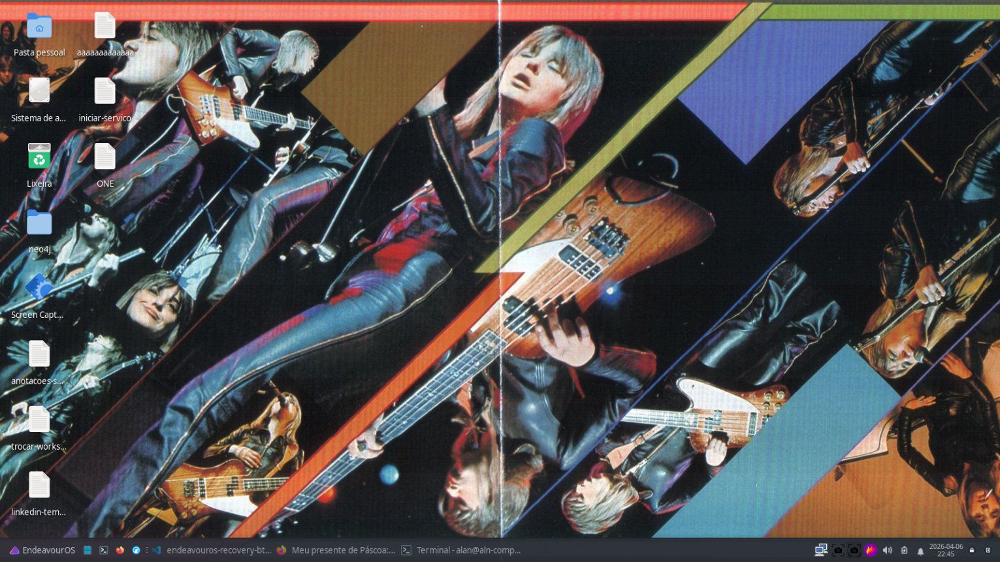

# O Problema: Quando o Cardio é melhor que o Boot

Era um domingo de Páscoa tranquilo. Desliguei o PC, fui fazer meu cardio e, ao voltar, fui recebido por uma tela que nenhum usuário Linux gosta de ver:

> `error: file '/@/boot/vmlinuz-linux' not found.`
> `you need to load the kernel first.`



O sistema simplesmente "esqueceu" como iniciar. O Kernel havia sumido ou o GRUB perdeu a referência.

Neste artigo, vou mostrar como recuperei meu sistema **EndeavourOS** sem formatar, garantindo a integridade dos meus dados e aprendendo muito no processo.

---

## 🧭 Guia de Navegação (Índice)

<nav class="article-toc" aria-label="Guia de navegação do artigo">
	<ul>
		<li><a href="#passo-1-diagnostico-via-live-usb">Passo 1: Diagnóstico via Live USB</a></li>
		<li><a href="#passo-2-o-dilema-do-backup">Passo 2: O dilema do backup</a></li>
		<li><a href="#passo-3-a-cirurgia-com-arch-chroot">Passo 3: A cirurgia com Arch-Chroot</a></li>
		<li><a href="#passo-4-regerar-a-configuracao-do-grub">Passo 4: Regerar a configuração do GRUB</a></li>
        <li><a href="#causa-raiz">Causa Raiz: O papel do MariaDB</a></li>
		<li><a href="#resultado">Resultado</a></li>
	</ul>
</nav>

<a id="passo-1-diagnostico-via-live-usb"></a>
## Passo 1: Diagnóstico via Live USB

O primeiro passo foi iniciar por um pendrive do EndeavourOS e inspecionar o disco:

```bash
lsblk
```



Nesse momento, confirmei que o sistema usava **Btrfs**. Isso muda tudo na recuperação, porque os dados ficam organizados em subvolumes (como `@` para raiz e `@home` para usuários).

<a id="passo-2-o-dilema-do-backup"></a>
## Passo 2: O dilema do backup

Antes da "cirurgia", tentei realizar um backup total da `/home`. A lição veio rápido: copiar milhares de arquivos pequenos (como `.cache` e `node_modules`) para mídia lenta pode levar muitas horas.



Decisão técnica: Cancelei a cópia massiva no meio do caminho. Optei por seguir para o reparo direto do bootloader.

<a id="passo-3-a-cirurgia-com-arch-chroot"></a>
## Passo 3: A cirurgia com Arch-Chroot

O `arch-chroot` permite entrar no sistema instalado a partir do ambiente Live.

### 3.1 Montar o subvolume correto

Em Btrfs, não basta montar a partição: é preciso montar o subvolume da raiz (`@`).

```bash
sudo mount -o subvol=@ /dev/sda1 /mnt
```

### 3.2 Entrar no sistema instalado

```bash
sudo arch-chroot /mnt
```

### 3.3 Sincronizar pacotes e reinstalar componentes críticos

Descobri que uma atualização anterior tinha sido interrompida, deixando o estado do sistema inconsistente. A recuperação foi:

```bash
# Finaliza atualizações pendentes
pacman -Syu

# Reinstala kernel, headers e firmware
pacman -S linux linux-headers linux-firmware

# Regenera a initramfs
mkinitcpio -P
```

<a id="passo-4-regerar-a-configuracao-do-grub"></a>
## Passo 4: Regerar a configuração do GRUB

Com o kernel novamente em `/boot/vmlinuz-linux`, faltava atualizar o bootloader:

```bash
grub-mkconfig -o /boot/grub/grub.cfg
```

Quando apareceu `Found linux image`, ficou claro que o sistema tinha voltado aos trilhos.

<a id="causa-raiz"></a>
## Causa Raiz Provável: O papel do MariaDB e o Stress de I/O

Investigando o histórico, surgiu a teoria principal: estresse de I/O massivo.

Pouco antes do problema, eu estava executando scripts pesados de inserção de dados no MariaDB e interrompi o processo abruptamente para sair.



O MariaDB gera uma carga de escrita constante e o Btrfs gerencia metadados via Copy-on-Write. É muito provável que uma atualização de sistema estivesse finalizando hooks em segundo plano e, devido à saturação do disco e ao cancelamento do banco, os arquivos do Kernel não foram sincronizados corretamente antes do PC desligar.

<a id="resultado"></a>
## Resultado

Após o desligamento seguro via terminal, a remoção de **ambos os pendrives** — tanto a mídia Live USB do EndeavourOS quanto o pendrive de 115GB onde a tentativa de backup foi cancelada — e o reinício da máquina, o sistema carregou perfeitamente, com todos os arquivos e configurações intactos.

### Lições aprendidas:

- **- Snapshots são essenciais**
- **- Entender subvolumes evita dor de cabeça**
- **- Cuidado com cargas de I/O**

Aqui está o resultado final, com o ambiente de trabalho 100% funcional:



Feliz Páscoa, e que seus boots sejam sempre bem-sucedidos!
