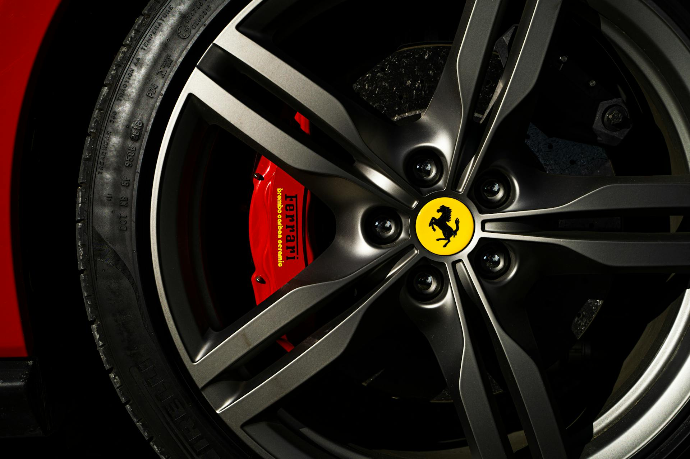

# O Problema: Quando o Cardio é melhor que o Boot

Era um domingo de Páscoa tranquilo. Desliguei o PC, fui fazer meu cardio e, ao voltar, fui recebido por uma tela que nenhum usuário Linux gosta de ver:

> `error: file '/@/boot/vmlinuz-linux' not found.`
> `you need to load the kernel first.`

O sistema simplesmente "esqueceu" como iniciar. O Kernel havia sumido ou o GRUB perdeu a referência. 

Neste artigo, vou mostrar como recuperei meu sistema **EndeavourOS** sem formatar, garantindo a integridade dos meus dados e aprendendo muito no processo.

---

## Passo 1: O Diagnóstico via Live USB

O primeiro passo foi dar boot por um pendrive do EndeavourOS. Através do terminal, usei o comando `lsblk` para identificar a estrutura do meu disco.
