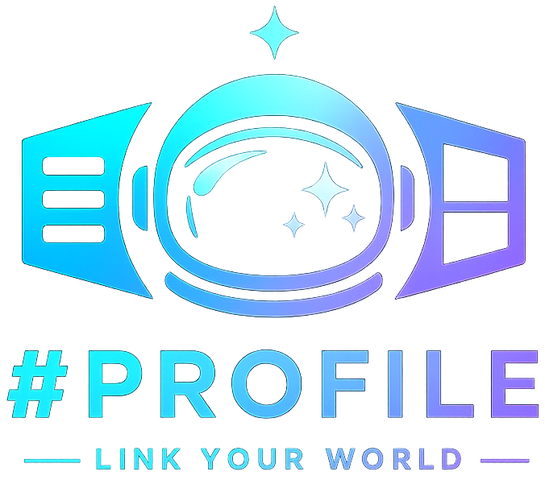

<p align="center">
    
</p>

<div align="center">


</div>

## 📖 Descrição <a name="descricao"></a>

Projeto em **Astro** para página de perfil pessoal com foco em links externos (Rate Your Music, MyAnimeList e Letterboxd), com duas propostas visuais acessíveis por rota:

- `v1`: layout centralizado com avatar e cards de links.
- `v2`: layout dividido em duas colunas com interação em destaque.

A rota `/` redireciona automaticamente para `/v1`.

## 🎯 Objetivo

Servir como “link hub” pessoal, com identidade visual forte e estrutura simples para manutenção de dados (nome, slogan, avatar e links) em um único lugar.

## 🧰 Stack

- **Astro 6**
- **Sass (SCSS)** para estilização e variáveis globais
- **Font Awesome** para ícones
- **@astrojs/vercel** para deploy em ambiente Vercel

## 🗺️ Rotas

- `/` → redireciona para `/v1`
- `/v1` → versão clássica do profile
- `/v2` → versão experimental com layout split

## 🏗️ Estrutura principal

```text
src/
├── components/
│   ├── v1/
│   │   ├── Avatar.astro
│   │   ├── LinkCard.astro
│   │   └── ProfileView.astro
│   └── v2/
│       ├── LinkCard.astro
│       └── ProfileView.astro
├── data/
│   └── profile.ts
├── layouts/
│   └── Layout.astro
├── pages/
│   ├── index.astro
│   ├── v1.astro
│   └── v2.astro
└── styles/
	└── _variables.scss
```

Isso permite alterar conteúdo sem mexer na estrutura dos componentes.

## 🎨 Estilo global

O layout base está em `src/layouts/Layout.astro`, que:

- importa variáveis SCSS globais;
- aplica fontes (`Inter`, `Orbitron` e, em `v2`, `Lora`);
- controla comportamento de rolagem por página via prop `enablePageScroll`.

As variáveis de tema estão em `src/styles/_variables.scss`.
